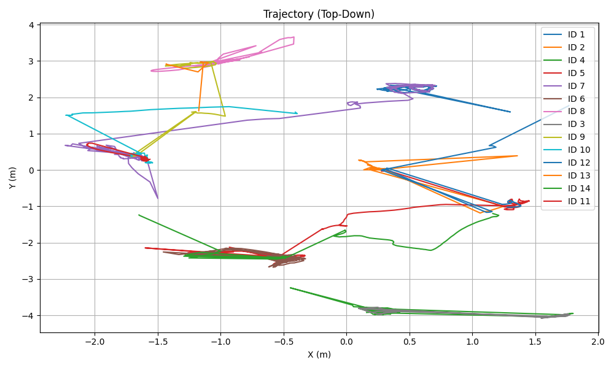
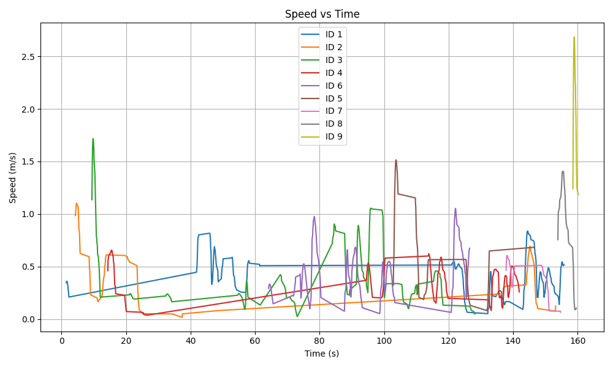

# Robust 3D Human Tracking in Point Clouds

## Overview

This project implements a **robust multi-object human tracking system in 3D point clouds** using geometric detection, probabilistic motion modeling, and temporal data association.  
The system operates entirely without ground-truth labels and is designed for real-world LiDAR-style point cloud sequences.

The pipeline consists of:
- Human detection from raw point clouds
- Multi-model Kalman filtering for motion estimation
- Optimal data association using Hungarian assignment
- Lightweight re-identification and track management
- Visualization, evaluation, and playback tools

---

## Algorithm Description

### 1. Human Detection

Human candidates are detected using **DBSCAN clustering** applied to the input point cloud after noise removal and ground-plane segmentation.

Each cluster is validated using **human-specific geometric constraints**:
- Height range: 0.4–2.2 m  
- Maximum width: ≤ 1.0 m  
- Minimum spatial density  

For valid clusters, a **shape descriptor** is extracted:
- Vertical aspect ratio
- Upper-body (head) density
- Variance in horizontal and vertical axes  

These descriptors are later used for association and identity stability.

---

### 2. Motion Modeling (IMM Kalman Filter)

Each track is modeled using an **Interacting Multiple Model (IMM) Kalman Filter** consisting of:
- Constant Velocity (CV) model
- Random Walk (RW) model

Key properties:
- 6D state: position (x, y, z) + velocity (vx, vy, vz)
- Adaptive time step (`dt`) computed from timestamps
- Model probabilities updated dynamically

This enables smooth tracking during motion while remaining stable during pauses.

---

### 3. Data Association

Track-to-detection matching is solved using:
- **Gating** based on Euclidean distance
- **Cost matrix** combining:
  - Spatial distance (80%)
  - Shape similarity (20%)
- **Hungarian algorithm** for optimal assignment

Associations exceeding the gating threshold are rejected to prevent ID swaps.

---

### 4. Track Management & Re-Identification

Tracks are classified as **dynamic** or **static** based on estimated speed:
- Static tracks are retained longer when temporarily occluded
- Dynamic tracks are removed faster to prevent drift

A lightweight **spatial re-identification** mechanism allows lost tracks to be recovered if a new detection appears close to the last known position.

Only tracks with sufficient temporal support (`min_hits`) are reported.

---

### 5. Output & Visualization

Tracking results are saved in a stable JSON schema (`tracking_results.json`) and used for:
- Real-time 3D playback with Open3D
- Annotated MP4 video generation
- Trajectory and speed plotting
- Quantitative evaluation without ground truth

---

## Implementation Challenges and Solutions

### Ground Plane & Noise Sensitivity
**Challenge:** Raw point clouds contain heavy noise and ground clutter.  
**Solution:** Statistical outlier removal followed by RANSAC plane segmentation.

---

### Identity Stability Without Appearance Features
**Challenge:** No RGB or appearance embeddings available.  
**Solution:** Shape descriptors + IMM-predicted motion + gating-based association.

---

### Variable Frame Rate
**Challenge:** Irregular timestamps cause unstable velocity estimates.  
**Solution:** Explicit timestamp parsing and dynamic `dt` handling in the Kalman filter.

---

### Visualization Consistency
**Challenge:** Open3D window resizing caused video corruption.  
**Solution:** Resolution locking at first frame capture for stable video encoding.

---

## Quantitative Results

Evaluation was performed **without ground truth** using proxy metrics:

| Metric | Value |
|------|------|
| Track Completeness | **1.000** |
| ID Consistency (Proxy) | **0.903** |
| Velocity Smoothness | **298.7 m/s²** |
| Velocity Plausibility | **0.899** |

**Interpretation:**
- The tracker successfully detects humans in all frames
- ID switches are rare but present during fast motion or occlusion
- Velocity remains mostly within human limits
- High jerk indicates occasional measurement noise or missed detections

---

## Trajectory and Motion Analysis

### Trajectory (Top-Down)

The following plot shows the estimated **2D ground-plane trajectory** of tracked humans:

---

### Speed vs Time

The plot below visualizes **instantaneous speed over time**, highlighting motion patterns and pauses:

---

## Limitations and Future Improvements

### Current Limitations
- No explicit appearance or learned features
- Limited re-identification robustness in crowded scenes
- Shape descriptor is heuristic and scene-dependent
- Vertical motion not explicitly constrained

---

### Future Improvements
- Learned point-cloud embeddings for Re-ID
- Joint Probabilistic Data Association (JPDA)
- Adaptive gating based on covariance
- Multi-hypothesis track management
- Ground-truth-based MOT metrics (MOTA, MOTP)
- GPU-accelerated clustering and filtering

---

## Conclusion

This system demonstrates that **robust human tracking in 3D point clouds is feasible without learning or labeled data**, using principled geometry, probabilistic filtering, and careful engineering.  
The modular design allows seamless extension toward learning-based or large-scale multi-object scenarios.
